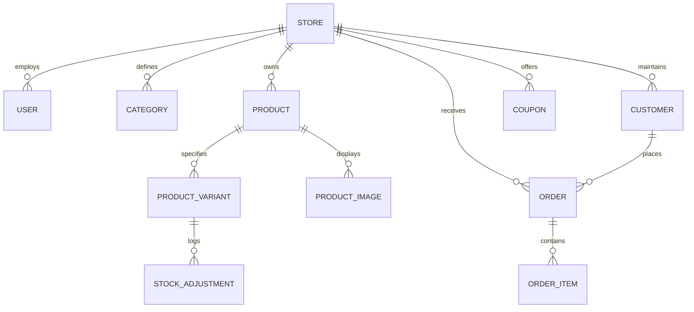

# NOIRÉ — Multi-Tenant Architecture & Technical Reference

## 1. Multi-Tenant Architectural Model

The platform is designed around a **Shared Database, Shared Schema with Tenant Scoping** pattern. This offers maximum operational simplicity for a SaaS while guaranteeing logical isolation between fashion brands.

```
                    Incoming Request
                           │
                           ▼
          TenantResolutionMiddleware
                           │
      ┌────────────────────┴────────────────────┐
      ▼                                         ▼
Storefront Visitor                      Merchant Admin
(X-Store-Slug / Subdomain)              (Bearer JWT + Role)
      │                                         │
      ▼                                         ▼
Public Scope (Store, Products,          Private Scope (Store Data,
Categories, Checkout)                   Inventory, Orders, Analytics)
      │                                         │
      └────────────────────┬────────────────────┘
                           ▼
              TenantModel QuerySet Filter
            .filter(store=request.store)
```

### Tenant Identification Priority:
1. `X-Store-Slug` HTTP header (primary for API communication).
2. Custom Domain (e.g. `brandname.com` mapped in `Store.custom_domain`).
3. Subdomain (e.g. `brandname.platform.com`).
4. Query Parameter fallback `?store=slug` (developer ease).
5. Default fallback to primary active store (`noire`).

---

## 2. Entity-Relationship Model (ERD)



### Models & Roles:
- **`Store`**: Master tenant entity. Controls currency, contact info, domains, and branding.
- **`User`**: Custom authentication model supporting `STORE_OWNER`, `STORE_ADMIN`, `CUSTOMER`, and `SUPERADMIN`.
- **`Product`**: Fashion item entity. Contains name, slug, pricing, comparison pricing, editorial descriptions, GSM, fabric, care instructions, and status (`ACTIVE`, `DRAFT`, `ARCHIVED`).
- **`ProductVariant`**: Granular SKU layer (`size` + `color_name` + `color_hex` + `stock_quantity`).
- **`Order`**: Transaction entity capturing customer information, Cairo/Giza delivery addresses, payment methods (`COD`, `CARD`, `INSTAPAY`), and status progression (`CONFIRMED` $\rightarrow$ `PREPARING` $\rightarrow$ `SHIPPED` $\rightarrow$ `DELIVERED` $\rightarrow$ `CANCELLED`).
- **`StockAdjustment`**: Audit log recording every inventory modification, whether from manual restock or customer order fulfillment.
- **`Coupon`**: Marketing engine supporting percentage discounts, fixed discounts, and complimentary courier thresholds.

---

## 3. Order Lifecycle State Machine

```
              ┌───────────────┐
              │   CONFIRMED   │◄── Order Placed (Cart checkout)
              └───────┬───────┘    Inventory decremented atomically
                      │
                      ▼
              ┌───────────────┐
              │   PREPARING   │◄── Studio packaging & quality check
              └───────┬───────┘
                      │
                      ▼
              ┌───────────────┐
              │    SHIPPED    │◄── Dispatched with domestic courier
              └───────┬───────┘
                      │
                      ▼
              ┌───────────────┐
              │   DELIVERED   │◄── Completed & payment settled
              └───────────────┘
                      ▲
                      │  (At any point prior to delivery)
              ┌───────┴───────┐
              │   CANCELLED   │
              └───────────────┘
```

---

## 4. API Endpoints Reference

### Public Storefront
- `GET /api/stores/current/`: Returns active brand configuration and currency.
- `GET /api/categories/`: Returns fashion taxonomy.
- `GET /api/products/`: Catalog with faceted filters (`category`, `size`, `color`, `sort`, `search`).
- `GET /api/products/<slug>/`: Detailed product view with full variant matrix and images.
- `POST /api/marketing/coupons/validate/`: Validate coupon code against cart subtotal.
- `POST /api/orders/checkout/`: Places order, decrements stock atomically, logs audit adjustment.
- `GET /api/orders/track/<order_number>/`: Order lookup for receipt display.

### Merchant Brand Administration
- `POST /api/auth/login/`: Issues JWT access and refresh tokens with store context.
- `GET /api/analytics/overview/`: Returns real-time KPIs, revenue timeline, and size/color breakdowns.
- `GET /api/products/`: Admin product list.
- `POST /api/products/`: Creates product with nested images and variant matrix.
- `PATCH /api/products/<slug>/`: Updates product properties.
- `DELETE /api/products/<slug>/`: Removes product.
- `GET /api/inventory/`: SKU-level inventory view with low-stock warnings.
- `POST /api/inventory/<variant_id>/update_stock/`: Modifies quantity and logs reason.
- `GET /api/orders/`: Orders list with status filter.
- `POST /api/orders/<order_id>/update_status/`: Transitions order through fulfillment lifecycle.
